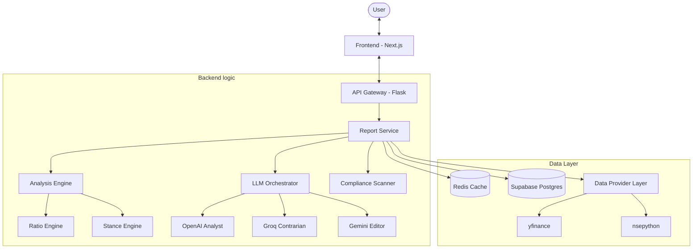
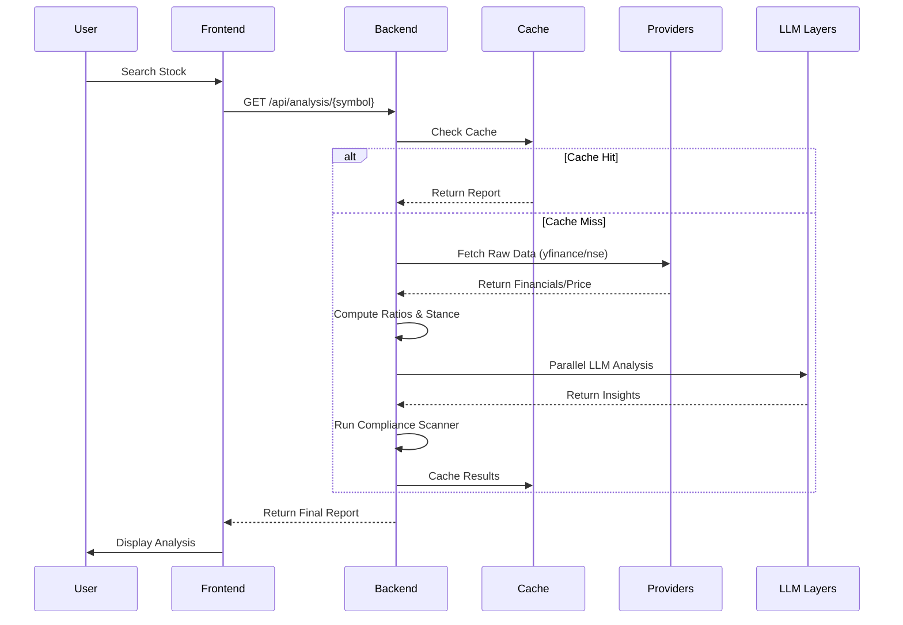

# System Architecture

## Overview
The Stock Analysis Platform is built with a decoupled architecture, using a Next.js frontend and a Flask backend.

```mermaid
graph TD
    User([User]) <--> Frontend[Frontend - Next.js]
    Frontend <--> API[API Gateway - Flask]
    
    subgraph Backend logic
        API --> ReportService[Report Service]
        ReportService --> Engine[Analysis Engine]
        Engine --> RatioEngine[Ratio Engine]
        Engine --> StanceEngine[Stance Engine]
        
        ReportService --> LLMOrchestrator[LLM Orchestrator]
        LLMOrchestrator --> OpenAI[OpenAI Analyst]
        LLMOrchestrator --> Groq[Groq Contrarian]
        LLMOrchestrator --> Gemini[Gemini Editor]
        
        ReportService --> Compliance[Compliance Scanner]
    end
    
    subgraph Data Layer
        ReportService --> Cache[(Redis Cache)]
        ReportService --> DB[(Supabase Postgres)]
        ReportService --> Provider[Data Provider Layer]
        Provider --> yfinance[yfinance]
        Provider --> nsepython[nsepython]
    end
```

## Key Sequence: End-to-End Analysis

```mermaid
sequenceDiagram
    participant U as User
    participant F as Frontend
    participant B as Backend
    participant C as Cache
    participant P as Providers
    participant L as LLM Layers

    U->>F: Search Stock
    F->>B: GET /api/analysis/{symbol}
    B->>C: Check Cache
    alt Cache Hit
        C-->>B: Return Report
    else Cache Miss
        B->>P: Fetch Raw Data (yfinance/nse)
        P-->>B: Return Financials/Price
        B->>B: Compute Ratios & Stance
        B->>L: Parallel LLM Analysis
        L-->>B: Return Insights
        B->>B: Run Compliance Scanner
        B->>C: Cache Results
    end
    B-->>F: Return Final Report
    F->>U: Display Analysis
```
